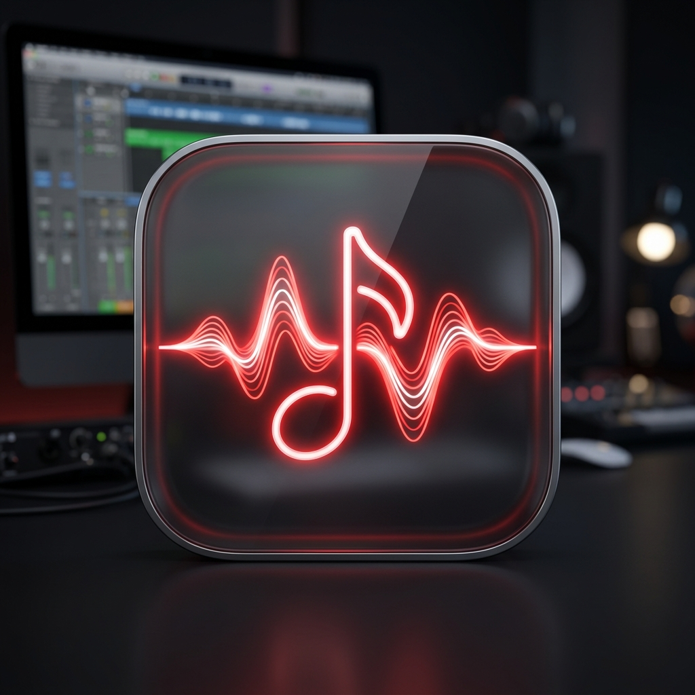

# PlanTop

<p align="center">
  
</p>

<h3 align="center">A Native, Stealth macOS Side-Panel Daily Planner & Google Calendar Companion</h3>

<p align="center">
  
  
  
  
  
</p>

---

## What is PlanTop?

**PlanTop** is a lightweight, stealth macOS daily planner and schedule companion built in pure Swift and AppKit. It integrates directly into macOS without cluttering your Dock:

1. **Right-Edge Hover Side Panel**: Move your cursor to the right edge of your screen to smoothly slide out your daily schedule, active countdowns, and upcoming tasks.
2. **Google Calendar Activity Hub**: View your schedule organized cleanly across **Classes**, **Today**, and **Tomorrow** tabs.
3. **Custom Class Detectors**: Define custom keywords (e.g. `Class IEL, Alfatih, Lecture, Lab`) to automatically categorize academic lectures and discussions.
4. **Interactive Meeting & Calendar Links**: One-click launch for Google Meet, Zoom, Teams, or direct calendar event entries.
5. **Menu Bar Live Glance**: Displays your active event (`[NOW] Lecture`) or upcoming start time in the macOS menu bar with a quick schedule dropdown.
6. **Futuristic Typography & White-Orange Theme**: Signature vibrant orange accents with large futuristic time badges (Alien League, Futura) and clean borderless white ceramic card surfaces.

---

## Quick Start & Download

### Option 1: Download Prebuilt Release
1. Download **[PlanTop.zip](PlanTop.zip)**.
2. Unzip the file to reveal `PlanTop.app`.
3. Drag `PlanTop.app` into your `/Applications` folder.
4. **First Launch**:
   - Double-click `PlanTop.app` in `/Applications` (or search for **PlanTop** in Spotlight).
   - If prompted by macOS Gatekeeper, right-click (or Control-click) `PlanTop.app` and choose **Open**, then click **Open**.
   - Alternatively, remove the quarantine attribute via Terminal:
     ```bash
     xattr -cr /Applications/PlanTop.app
     ```

### Option 2: Build from Source
```bash
git clone https://github.com/EvanDSiever/PlanTop.git
cd PlanTop
./build_app.sh
```
This compiles the `.app` bundle at `./PlanTop.app` and generates the release package at `./PlanTop.zip`.

---

## How to Use PlanTop

### 1. Seamless Background Integration (No Dock Icon)
PlanTop runs as a native macOS **Accessory (`LSUIElement`)**. It never takes up space in your macOS Dock, keeping your workspace clean and distraction-free.

### 2. Accessing PlanTop
- **Menu Bar**: Look for the calendar clock icon in the top right menu bar. Click it to view upcoming schedule items or open **PlanTop Settings & Preferences...**.
- **Spotlight Search**: Press `Cmd + Space`, type `PlanTop`, and press `Enter` to open settings at any time.

### 3. Right-Edge Hover Panel
- Move your mouse cursor towards the right edge of your display.
- The planner panel smoothly slides out with a high-velocity ease-out deceleration curve.
- Hover away to let it retract automatically, or click the pin button to keep it fixed on screen.
- Drag the left edge of the panel to resize anywhere between 260px and 650px.

### 4. Google Calendar & Custom Class Detectors
- In **Settings & Preferences**, grant Calendar access or configure your Google Calendar secret iCal URL.
- In the **Class Detectors** field, enter keywords separated by commas (e.g. `Class IEL, Alfatih, Lecture, Lab`).
- Any calendar event with matching keywords automatically routes to your dedicated **Classes** tab.
- Click any event card in the panel to expand details (time span, location, notes, and direct Google Meet button).

### 5. Appearance & Color Customization
- Open Settings to customize:
  - **Accent Colors**: Orange (`#FF700D`), Coral, Blue, Green, Purple, or pick custom colors using the native color picker.
  - **Time Font**: Choose between Alien League Condensed, Alien League Regular, Futura Condensed Light, SF Pro Rounded, and Monospaced.
  - **App Typography**: Toggle between SF Pro Rounded, System Default, Monospaced, and Serif.

### 6. Run at Startup (Launch at Login)
- Open PlanTop Settings.
- Under **System & Menu Bar Integration**, check **Launch PlanTop automatically at login**.

---

## Keyboard & Window Shortcuts

| Action | Shortcut / Method |
| :--- | :--- |
| **Open Settings** | Search "PlanTop" in Spotlight or click Menu Bar icon > Settings |
| **Toggle Side Panel** | Menu Bar icon > Toggle Side Panel (`Cmd + P`) |
| **Open Calendar App** | Menu Bar icon > Open Calendar App (`Cmd + C`) |
| **Sync Calendar** | Click sync button on side panel or Menu Bar (`Cmd + R`) |
| **Quit App** | Menu Bar icon > Quit PlanTop (`Cmd + Q`) |

---

## Requirements
- **macOS**: 13.0 (Ventura) or later (macOS Sonoma & Sequoia fully supported).
- **Architecture**: Apple Silicon (M1/M2/M3/M4) & Intel Universal.

---

## License
MIT License. Created by Evan Siever.
