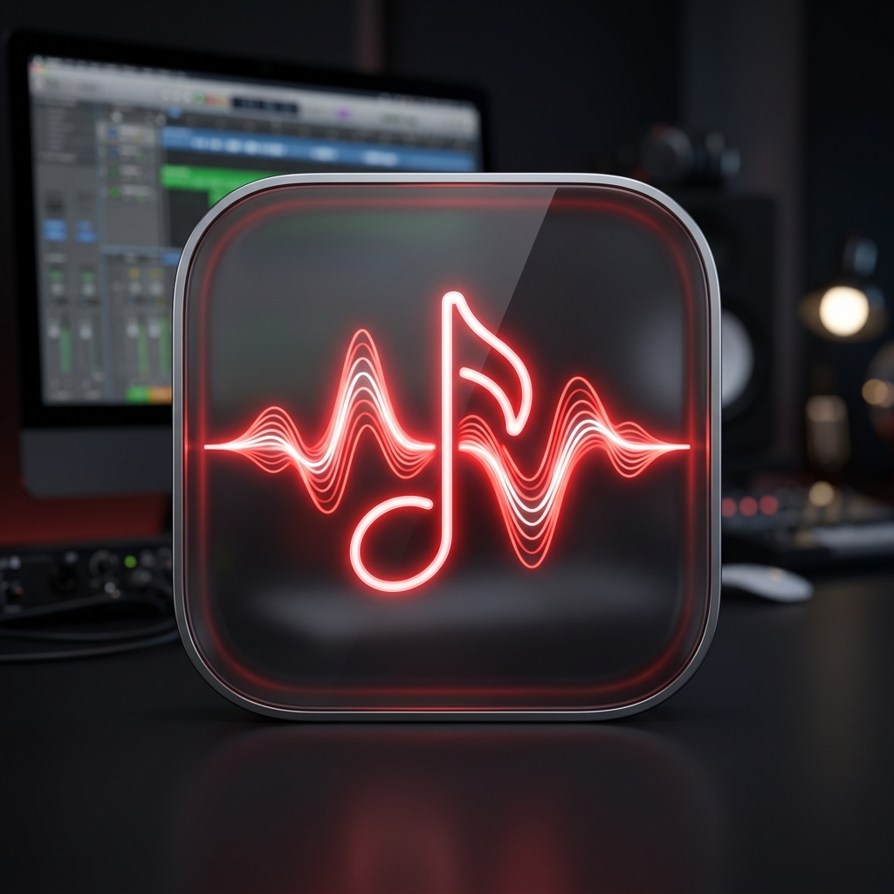

# PlanTop

<p align="center">
  
</p>

<h3 align="center">A Native, Stealth macOS Side-Panel Daily Planner & Google Calendar Companion</h3>

<p align="center">
  
  
  
  
  
</p>

---

## What is PlanTop?

**PlanTop** is a lightweight, stealth macOS daily planner and schedule companion built in pure Swift and AppKit. It integrates directly into macOS without cluttering your Dock:

1. **Right-Edge Hover Side Panel**: Move your cursor to the right edge of your screen to smoothly slide out your daily schedule, active countdowns, and upcoming tasks.
2. **Google Calendar Activity Hub**: View your schedule organized cleanly across **Classes**, **Tasks** (Homework & Reports), **Today**, and **Tomorrow** tabs.
3. **Custom Class & Task Detectors**: Define custom keywords to categorize academic lectures, or use `REPORT` and `HOMEWORK` prefixes to automatically route assignments and project milestones. Tasks are strictly limited to the current week (starting on Monday at 00:00:00 and ending on Sunday at 23:59:59). For tasks occurring today, live countdown timers are kept on; for future tasks within the week, the scheduled occurrence date is shown directly underneath the title. Recurring and repeated tasks across weeks automatically deduplicate to keep only the current week's upcoming instance.
4. **Instant Quick Notes with Rich Formatting & Lists**: Zero-friction writing space directly below the clock with title bar removed for instant typing. Supports bullet points (`- ` / `• `), numbered lists (`1. `), bold (`**...**`), italic (`*...*`), smart Return auto-continuation, live markdown syntax styling, and larger 14.5pt Avenir typography.
5. **Interactive Meeting & Calendar Links**: One-click launch for Google Meet, Zoom, Teams, or direct calendar event entries.
6. **Menu Bar Live Glance**: Displays your active event (`[NOW] Lecture`) or upcoming start time in the macOS menu bar with a quick schedule dropdown.
7. **Apple HIG-Inspired Liquid Glass Design**: Translucent Liquid Glass materials (`NSVisualEffectView` HUD vibrance), single SF Pro system typography family with monospaced digits, 8pt layout grid, 44pt hit targets, and fully adaptive semantic system colors (`systemBlue`, `label`, `systemBackground`).

---

## Quick Start & Download

### Option 1: Download Prebuilt Release
1. Download **[PlanTop.zip](PlanTop.zip)**.
2. Unzip the file to reveal `PlanTop.app`.
3. Drag `PlanTop.app` into your `/Applications` folder.
4. **First Launch**:
   - Double-click `PlanTop.app` in `/Applications` (or search for **PlanTop** in Spotlight).
   - If prompted by macOS Gatekeeper, right-click (or Control-click) `PlanTop.app` and choose **Open**, then click **Open**.
   - Alternatively, remove the quarantine attribute via Terminal:
     ```bash
     xattr -cr /Applications/PlanTop.app
     ```

### Option 2: Build from Source
```bash
git clone https://github.com/EvanDSiever/PlanTop.git
cd PlanTop
./build_app.sh
```
This compiles the `.app` bundle at `./PlanTop.app` and generates the release package at `./PlanTop.zip`.

---

## How to Use PlanTop

### 1. Seamless Background Integration (No Dock Icon)
PlanTop runs as a native macOS **Accessory (`LSUIElement`)**. It never takes up space in your macOS Dock, keeping your workspace clean and distraction-free.

### 2. Accessing PlanTop
- **Menu Bar**: Look for the calendar clock icon in the top right menu bar. Click it to view upcoming schedule items or open **PlanTop Settings & Preferences...**.
- **Spotlight Search**: Press `Cmd + Space`, type `PlanTop`, and press `Enter` to open settings at any time.

### 3. Right-Edge Hover Panel
- Move your mouse cursor towards the right edge of your display.
- The planner panel smoothly slides out with a high-velocity ease-out deceleration curve.
- Hover away to let it retract automatically, or click the pin button to keep it fixed on screen.
- Drag the left edge of the panel to resize anywhere between 260px and 650px.

### 4. Google Calendar & Custom Class Detectors
- In **Settings & Preferences**, grant Calendar access or configure your Google Calendar secret iCal URL.
- In the **Class Detectors** field, enter keywords separated by commas (e.g. `Class IEL, Alfatih, Lecture, Lab`).
- Any calendar event with matching keywords automatically routes to your dedicated **Classes** tab.
- Click any event card in the panel to expand details (time span, location, notes, and direct Google Meet button).

### 5. Instant Quick Notes with Rich Formatting & Lists
- **Instant Writing**: Click anywhere in the notes card to start typing immediately with zero header clutter.
- **Larger Font Size**: Upgraded from 12.5pt to 14.5pt Avenir typography for clear readability.
- **Lists & Formatting**:
  - Type `- ` or `• ` for bullet points, and `1. ` for numbered lists. `Return` auto-continues lists, and `Return` on an empty line cleanly exits the list.
  - Wrap words in `**bold**` or `*italic*`, or use keyboard shortcuts `Cmd + B` and `Cmd + I`.
  - Use the bottom mini-toolbar for quick one-click formatting (`•`, `1.`, `B`, `I`, and Clear).
  - All notes are auto-saved to persistent storage.

### 6. Appearance & Color Customization
- Open Settings to customize:
  - **Accent Colors**: Apple System Blue (`#007AFF`), Purple (`#AF52DE`), Green (`#34C759`), Orange (`#FF9500`), Red (`#FF3B30`), or pick custom colors using the native color picker.
  - **Time Font**: Choose between SF Pro Monospaced Digits (Default), SF Pro Rounded, SF Mono, Futura Condensed Light, and Alien League.
  - **App Typography**: Toggle between SF Pro (System Default), SF Pro Rounded, SF Mono, Avenir, and System Serif.

### 7. Run at Startup (Launch at Login)
- Open PlanTop Settings.
- Under **System & Menu Bar Integration**, check **Launch PlanTop automatically at login**.

---

## Keyboard & Window Shortcuts

| Action | Shortcut / Method |
| :--- | :--- |
| **Open Settings** | Search "PlanTop" in Spotlight or click Menu Bar icon > Settings |
| **Toggle Side Panel** | Menu Bar icon > Toggle Side Panel (`Cmd + P`) |
| **Open Calendar App** | Menu Bar icon > Open Calendar App (`Cmd + C`) |
| **Sync Calendar** | Click sync button on side panel or Menu Bar (`Cmd + R`) |
| **Quit App** | Menu Bar icon > Quit PlanTop (`Cmd + Q`) |

---

## Requirements
- **macOS**: 13.0 (Ventura) or later (macOS Sonoma & Sequoia fully supported).
- **Architecture**: Apple Silicon (M1/M2/M3/M4) & Intel Universal.

---

## License
MIT License. Created by Evan Siever.
